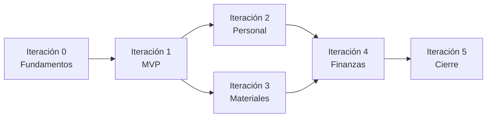

# Plan de iteraciones — Sistema de Gestión de Obras (Pages & Familia)

> Documento operativo de desarrollo. Las iteraciones siguen la metodología ágil y la priorización definida en `Documentacion_Ing_Software.md` (sección 20).  
> **Stack:** ASP.NET Core Razor Pages · C# · Entity Framework Core · MySQL (Pomelo) · GitHub

---

## 1. Propósito del sistema

Centralizar la información operativa de la constructora **Pages & Familia**, reemplazando planillas, WhatsApp y papel por una aplicación web única donde el administrador pueda:

- Registrar y consultar obras con su estado y avance.
- Asignar personal y registrar horas.
- Controlar materiales, compras y costos.
- Registrar ingresos/egresos y evaluar rentabilidad por obra.
- Acceder a un panel consolidado con métricas generales.
- Operar con usuarios, roles y permisos de acceso.

**Actor principal:** Alejandro Pages (Administrador).  
**Actores secundarios (datos, no usuarios del sistema):** empleados/subcontratistas, clientes comitentes.

---

## 2. Modelo relacional (base de datos `pages_familia`)

Entidades generadas por scaffolding EF Core desde MySQL. Relaciones principales:

| Entidad | Tabla | Rol en el negocio | Relaciones clave |
|---------|-------|-------------------|------------------|
| `Cliente` | `cliente` | Comitente de la obra | 1:N → `Obra` |
| `EstadoObra` | `estado_obra` | Etapa/estado del proyecto | 1:N → `Obra` |
| `Obra` | `obra` | Núcleo del sistema | N:1 `Cliente`, `EstadoObra`; 1:N `Asignacion`, `MovimientoFin`, `ObraMaterial` |
| `Empleado` | `empleado` | Personal fijo o subcontratista | N:1 `Oficio`; 1:N `Asignacion`; 1:1 opcional `Usuario` |
| `Oficio` | `oficio` | Albañil, electricista, etc. | 1:N → `Empleado` |
| `Asignacion` | `asignacion` | Empleado en obra con tarea y fechas | N:1 `Empleado`, `Obra`; 1:N `RegistroHora` |
| `RegistroHora` | `registro_horas` | Horas trabajadas por asignación | N:1 `Asignacion` |
| `Material` | `material` | Catálogo de insumos | 1:N → `ObraMaterial` |
| `ObraMaterial` | `obra_material` | Material requerido por obra | N:1 `Obra`, `Material`; 1:N `Compra` (único por obra+material) |
| `Compra` | `compra` | Adquisición de material | N:1 `ObraMaterial`; 1:1 `MovimientoFin` |
| `CategoriaMov` | `categoria_mov` | Categoría de ingreso/egreso | 1:N → `MovimientoFin` |
| `MovimientoFin` | `movimiento_fin` | Ingreso o egreso por obra | N:1 `Obra`, `CategoriaMov`; 1:1 opcional `Compra` |
| `Usuario` | `usuario` | Acceso al sistema | N:M `Rol` (`usuario_rol`); auditoría en altas |
| `Rol` | `rol` | Permisos de acceso | N:M `Usuario` |

**Convenciones técnicas detectadas en código:**

- `PagesFamiliaContext` como `DbContext` principal (scaffold).
- Campos de auditoría: `creado_por`, `fecha_creacion` en registros operativos.
- Soft delete lógico: `activo`, `fecha_baja` en entidades principales.
- Arquitectura prevista: capas **Pages → Services → Repositories → DbContext**.

---

## 3. Estado actual del proyecto

| Área | Estado |
|------|--------|
| Documentación IDS | Completa (`Documentacion_Ing_Software.md`) |
| Modelo EF Core (15 entidades) | Scaffold desde MySQL |
| `Program.cs` (DI, sesión, MySQL) | Configurado |
| Capa Repositories / Services | Referenciada en código, **pendiente de implementación** |
| Autenticación (Login/Logout) | Referenciada, **pendiente** |
| ABM Obras / Clientes / Estados | Referenciado en navegación, **pendiente** |
| Dashboard (`Index`) | Vista parcial; depende de repositorios |
| Módulos Personal, Materiales, Finanzas | Deshabilitados en navegación |
| Diseño UI / identidad visual | **Pendiente** (espera especificación del equipo) |
| Pruebas unitarias | Pendiente |

---

## 4. Iteraciones de desarrollo

### Iteración 0 — Fundamentos (Marzo 2026)

**Objetivo:** Base técnica estable antes del MVP.

| Tarea | Entidades / artefactos | Criterio de done |
|-------|------------------------|------------------|
| Definir y crear esquema MySQL | Todas las tablas | BD `pages_familia` operativa con integridad referencial |
| Scaffolding EF Core | `Models/`, `PagesFamiliaContext` | Modelos sincronizados con BD |
| Configurar conexión vía `appsettings.json` | — | Sin connection string hardcodeada en producción |
| Estructura de capas (Repositories, Services, ViewModels) | Interfaces base | Proyecto compila con DI registrado |
| Repositorio Git + ramas (`main`, `develop`, `feature/*`) | — | Según plan SCM del IDS |
| Documentación de plan y changelog | `Documents/` | Este documento y `Changelog.md` creados |

**Requerimientos IDS:** preparación para RF1–RF6.  
**Entregable:** proyecto ejecutable con capa de datos lista.

---

### Iteración 1 — MVP (Abril – Mayo 2026) · Criticidad ALTA

**Objetivo:** Acceso seguro, gestión de obras y panel básico.  
**Requerimientos:** RF1, RF5 (parcial), RF6 (parcial).  
**User Stories:** US1, US5 (parcial), US6 (parcial).

#### 1.1 Autenticación y sesión

- Páginas `Account/Login`, `Account/Logout`.
- `AuthService` + `UsuarioRepository`: validación email/contraseña (hash).
- Sesión: `UsuarioId`, `UsuarioNombre`, roles en sesión o claims.
- Protección de páginas: redirección si no hay sesión activa.
- Seed inicial: usuario administrador y roles base (`Administrador`, etc.).

**Entidades:** `Usuario`, `Rol`, `usuario_rol`.

#### 1.2 Gestión de usuarios y roles (parcial)

- ABM de usuarios (alta, edición, baja lógica).
- Asignación de roles a usuario.
- Restricción de rutas sensibles según rol (mínimo: solo admin configura usuarios).

**Entidades:** `Usuario`, `Rol`, `Empleado` (vínculo opcional).

#### 1.3 ABM de obras

- CRUD de obras con cliente y estado.
- ABM de clientes (`Cliente`).
- Catálogo de estados de obra (`EstadoObra`) — consulta y asignación; alta de estados según necesidad.
- Validaciones: campos obligatorios, fechas coherentes, soft delete.

**Entidades:** `Obra`, `Cliente`, `EstadoObra`.

#### 1.4 Panel básico (Dashboard)

- Contadores: obras activas, clientes activos.
- Listado de obras recientes con estado y cliente.
- Enlaces a detalle y alta de obra.

**Entidades consultadas:** `Obra`, `Cliente`, `EstadoObra`.

#### 1.5 Diseño e identidad visual (Iteración 1)

- Aplicar guía de diseño acordada por el equipo (colores, tipografía, layout).
- `_Layout.cshtml`, `site.css`, componentes reutilizables (cards, tablas, badges de estado).
- Interfaz responsive y liviana (requisito de conectividad variable en obra).

#### 1.6 Pruebas Iteración 1

- Login válido / inválido.
- Alta de obra visible en listado y panel.
- Acceso restringido sin sesión.
- Regresión informal de flujos anteriores.

**Entregable:** versión funcional con acceso seguro y registro de obras.  
**Tag SCM sugerido:** `v0.1-mvp`

---

### Iteración 2 — Personal (Mayo 2026) · Criticidad MEDIA

**Objetivo:** ABM de empleados y asignación a obras.  
**Requerimientos:** RF3.  
**User Stories:** US2.

#### 2.1 Catálogo de oficios

- ABM o consulta de `Oficio`.

#### 2.2 ABM de empleados

- Alta/edición/baja lógica de empleados (fijo / subcontratista).
- Asociación a oficio.

**Entidades:** `Empleado`, `Oficio`.

#### 2.3 Asignaciones a obras

- Asignar empleado a obra con tarea, `fecha_inicio`, `fecha_fin`.
- Listado de personal por obra y obras por empleado.
- Evitar solapamientos incoherentes (validación de fechas).

**Entidades:** `Asignacion`, `Obra`, `Empleado`.

#### 2.4 Registro de horas (opcional en alcance mínimo)

- Carga de `RegistroHora` por asignación.
- Total de horas por obra en panel (extensión de RF5).

**Entidades:** `RegistroHora`, `Asignacion`.

#### 2.5 UI y navegación

- Habilitar módulo **Personal** en topbar.
- Vistas integradas con diseño de Iteración 1.

#### 2.6 Pruebas Iteración 2

- Asignación persiste y aparece en detalle de obra.
- Baja lógica de empleado no elimina historial de asignaciones.

**Entregable:** módulo de personal integrado.  
**Tag SCM sugerido:** `v0.2-personal`

---

### Iteración 3 — Materiales (Mayo – Junio 2026) · Criticidad MEDIA

**Objetivo:** Materiales requeridos, compras y control de costos unitarios.  
**Requerimientos:** RF4.  
**User Stories:** US4.

#### 3.1 Catálogo de materiales

- ABM de `Material` (nombre, unidad, activo).

#### 3.2 Materiales por obra

- Asociar material a obra con `cant_requerida` (`ObraMaterial`).
- Vista: requerido vs. comprado (suma de compras).

**Entidades:** `ObraMaterial`, `Material`, `Obra`.

#### 3.3 Registro de compras

- Alta de `Compra` ligada a `ObraMaterial`.
- Generación automática de `MovimientoFin` (egreso) vinculado 1:1.
- Cálculo: cantidad × costo unitario.

**Entidades:** `Compra`, `MovimientoFin`, `CategoriaMov` (categoría “Compra material” u equivalente).

#### 3.4 UI y navegación

- Habilitar módulo **Materiales**.
- Alertas visuales: material faltante, compras duplicadas potenciales.

#### 3.5 Pruebas Iteración 3

- Compra registrada incrementa egreso de la obra.
- No se duplica `ObraMaterial` para mismo par obra+material.

**Entregable:** módulo de materiales y compras.  
**Tag SCM sugerido:** `v0.3-materiales`

---

### Iteración 4 — Finanzas y panel completo (Junio 2026) · Criticidad ALTA

**Objetivo:** Ingresos/egresos, rentabilidad y dashboard consolidado.  
**Requerimientos:** RF2, RF5 (completo).  
**User Stories:** US3, US5 (completo).

#### 4.1 Movimientos financieros

- ABM de `MovimientoFin` por obra (ingreso/egreso).
- Categorización vía `CategoriaMov`.
- Movimientos manuales independientes de compras.

**Entidades:** `MovimientoFin`, `CategoriaMov`, `Obra`.

#### 4.2 Reportes y rentabilidad

- Totales de ingresos, egresos y balance por obra.
- Resumen por obra activa/finalizada.
- Exportación básica (CSV o vista imprimible) si el tiempo lo permite.

#### 4.3 Panel completo

- Métricas: horas activas, estado de cada obra, avance general.
- Integración de datos de Iteraciones 2 y 3.
- Habilitar módulos **Finanzas** y **Reportes**.

#### 4.4 Roles y permisos (completo)

- Matriz de permisos por rol documentada e implementada.
- US6 cumplida: acciones no autorizadas bloqueadas con mensaje claro.

#### 4.5 Pruebas Iteración 4

- Gasto asociado a obra correcta; balance coherente.
- Panel refleja datos de todos los módulos.
- Integridad: no registros huérfanos al eliminar obra (restricción o cascada controlada).

**Entregable:** reportes financieros y panel general consolidado.  
**Tag SCM sugerido:** `v1.0`

---

### Iteración 5 — Cierre y entrega (Junio – Julio 2026) · Criticidad ALTA

**Objetivo:** Producto listo para el cliente.

| Actividad | Responsable principal |
|-----------|-------------------------|
| Pruebas de aceptación con Alejandro Pages | Facundo Villalba (SQA) |
| Corrección de defectos de gravedad alta/media | Equipo |
| Capacitación incremental (manual + sesión guiada) | Juan Meny |
| Documentación final de usuario | Juan Meny |
| Despliegue en hosting de prueba/producción | Alex Roth |
| Tag final y merge a `main` | Alex Roth (SCM) |

**Criterio de aceptación (IDS §17.5):** casos críticos OK, sin defectos graves abiertos, validación del cliente en reunión de cierre.

---

## 5. Mapa de requerimientos → iteraciones

| RF | Descripción | Iteración |
|----|-------------|-----------|
| RF1 | ABM obras, estado y progreso | 1 |
| RF2 | Ingresos/egresos por proyecto | 4 |
| RF3 | ABM personal y asignación | 2 |
| RF4 | Materiales, costos y compras | 3 |
| RF5 | Panel de control | 1 (básico) → 4 (completo) |
| RF6 | Usuarios, roles y permisos | 1 (parcial) → 4 (completo) |

| RNF | Iteración transversal |
|-----|----------------------|
| Seguridad (auth + roles) | 1 → 4 |
| Usabilidad | 1 (diseño) + todas |
| Disponibilidad web | Todas |
| Integridad referencial | 0 + validaciones en cada módulo |

---

## 6. Dependencias entre iteraciones

- **Iteración 1** es bloqueante para todas las demás.
- **Iteraciones 2 y 3** pueden desarrollarse en paralelo tras el MVP.
- **Iteración 4** requiere datos de personal (horas) y materiales (egresos por compra).

---

## 7. Sincronización con `Changelog.md`

Cada cambio significativo en código, BD o documentación debe registrarse en `Changelog.md` con:

- Fecha
- Iteración
- Tipo (`Added`, `Changed`, `Fixed`, `Removed`)
- Descripción breve
- Referencia a PR/commit cuando aplique

---

## 8. Próximo paso inmediato

1. **Especificación de diseño UI** (pendiente del equipo).
2. Implementar capa Repositories/Services faltante.
3. Completar **Iteración 1** según tareas 1.1–1.6.

---

*Última actualización: 24/06/2026 — Equipo Pages & Familia (Juan Meny, Alex Roth, Facundo Villalba)*
